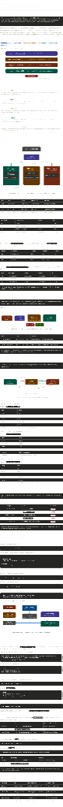

# Nisha.sec — Cybersecurity Portfolio

A high-performance, interactive portfolio website tailored for a Cybersecurity Professional / SOC Analyst. Built with a "defense-in-depth" aesthetic, featuring glassmorphism UI, real-time command-line animations, and advanced Framer Motion interactions.

 *(Replace with actual screenshot)*

## 🚀 Core Features & Technical Engineering

### 1. Interactive Technical Arsenal
A custom-built, highly dynamic modal system engineered to showcase technical skills rather than just listing them.
- **Glassmorphism UI**: Interacting with a skill card triggers a fluid, hardware-accelerated Framer Motion modal.
- **Custom Cyber Visualizers**: Each technical domain features a unique SVG animation built entirely in React (no heavy external video files):
  - **SIEM / Wazuh**: A sweeping 360-degree radar highlighting detected "threats".
  - **Network Security**: Animated traffic passing through firewall gates.
  - **Incident Response**: Sonar pulse ripples simulating rapid detection and isolation.
  - **WAF / SafeLine**: A shield intercepting red malicious nodes while allowing green traffic through.

### 2. Deep Dive: The SOC Lab Project (`/project/soc-lab`)
An immersive, interactive case study page detailing a multi-zone virtualized SOC environment. This is not static text; it's a presentation layer engineered to mirror modern dashboard analytics.
- **Animated Network Topology**: A fully coded, animated SVG architecture diagram showing Kali Linux (attacker) sending payloads to a DMZ through a pfSense firewall, visually highlighting blocked vs. clean traffic paths in real-time.
- **Defense Layers**: Interactive rows detailing the specific configurations of the cyber stack.
  - **pfSense**: Routing and strict ACL configuration.
  - **Suricata**: Intrusion Detection System (IDS) capturing and logging malicious signatures.
  - **SafeLine WAF**: Web Application Firewall functioning as a reverse proxy blocking SQLi, XSS, and LFI.
  - **Wazuh SIEM**: Centralized log shipping, File Integrity Monitoring (FIM), and SSH brute-force detection.
- **Attack Flow Stepper**: An automated timeline pipeline demonstrating how a malicious payload travels from the attacker through the various defense layers to the ultimate block/allow decision.

### 3. Real-Time Terminal & Hacker Aesthetics
- **Nmap Animation (`NmapAnimation.jsx`)**: A meticulously constructed React component that mimics a real-time terminal executing an Nmap scan. It dynamically types out commands, calculates realistic pseudo-latency, and scrolls through discovered open ports to grab the viewer's attention instantly.
- **Neon Glow & Shadows**: Native deep-dark theme (`#0b0f19`) utilizing optimized backdrop filters and glowing neon accents (Cyan, Blue, Purple) to replicate premium terminal environments.

### 4. Custom Local AI Assistant (`AIModal.jsx`)
Integrated an interactive chat modal component acting as a pseudo-assistant, continuing the immersive hacker narrative while providing quick navigation or contextual information to recruiters.

### 5. Highly Responsive & Performant Layout
- **Strict Viewport Controls**: Uses `max-h-[85vh]` clamps and `overflow-y-auto` internal scrolling hooks. This guarantees that complex modals never clip off the screen on small mobile devices like an iPhone SE.
- **60 FPS Framer Motion**: Animations specifically target GPU-friendly properties (`transform`, `opacity`, `rotate`) to prevent UI jank, latency, or battery drain.

## 🛡️ SOC Lab Environment & Documentation

Built directly into the portfolio is a highly detailed, interactive case study of a virtualized SOC environment (`/project/soc-lab`).



### Lab Architecture & Objectives
- **Objective:** Simulate a multi-zone enterprise network, implement segmentation via pfSense, deploy Suricata IDS & SafeLine WAF, and centralize logs with Wazuh SIEM.
- **Hypervisor:** Oracle VirtualBox 7.x (Host OS: Windows 11)
- **Virtual Machines:** 5 total
- **Network Addressing:**
  - **LAN:** `192.168.10.0/24` (Hosts Wazuh SIEM and endpoint clients)
  - **DMZ:** `192.168.20.0/24` (Hosts deliberately vulnerable web app (DVWA) via SafeLine reverse proxy)
  - **TEST:** `192.168.30.0/24` (Attacker machine running Kali Linux)

### Tool Configurations & Implementations

#### 1. pfSense Firewall
- Acts as the central router between all three zones. Configured with strict ACL rules to control inter-zone traffic flow and NAT for outbound connectivity.
- *Sample Config:* `BLOCK TEST → LAN:*` (Isolates attacker from internal LAN).

#### 2. Suricata IDS
- Deployed on pfSense, monitoring the DMZ interface using ET Open rulesets for signature-based detection.
- Outputs structured `eve.json` logs directly to Wazuh for ingestion.

#### 3. SafeLine WAF
- Deployed as a reverse proxy in the DMZ zone on port 443. All traffic to DVWA (`:8080`) routes through SafeLine.
- *Modules Enabled:* SQL Injection Detection, XSS Filter, Command Injection Blocker, LFI Guard, and File Upload Scanner.

#### 4. Wazuh SIEM
- Central manager runs on the LAN zone, collecting logs from agents deployed on the DVWA server and pfSense.
- Provides File Integrity Monitoring (FIM) and SSH brute-force detection across the network.

### Key Findings
1. **WAF Performance:** SafeLine WAF successfully blocked 100% of OWASP Top 5 Attacks during controlled testing.
2. **IDS Real-Time Detection:** Suricata's ET Open ruleset rapidly flagged test traffic, generating alerts securely transmitted to Wazuh.
3. **FIM Activation:** Wazuh successfully caught unauthorized file changes in `/var/www` within the 300-second scan interval.
4. **Network Segmentation:** pfSense ACL rules mathematically ensured the Kali attacker could not traverse into the internal LAN zone.

## 🛠️ Tech Stack

- **Framework**: [React.js](https://reactjs.org/) using [Vite](https://vitejs.dev/)
- **Routing**: React Router DOM (`v6`)
- **Styling**: [Tailwind CSS](https://tailwindcss.com/)
- **Animations**: [Framer Motion](https://www.framer.com/motion/)
- **Icons**: [Lucide React](https://lucide.dev/)
- **Toasts**: [React Hot Toast](https://react-hot-toast.com/)

## 📂 Project Navigation

```text
src/
├── components/          # Reusable UI elements
│   ├── Hero.jsx         # Landing page hero with Nmap animation
│   ├── Navbar.jsx       # Floating responsive frosted-glass navbar
│   ├── Stack.jsx        # Technical Arsenal grid and interactive modal
│   ├── AIModal.jsx      # Global AI Assistant popup
│   └── ...              # Other core components (Work, Contact, etc.)
├── pages/               # Primary routed views
│   ├── Home.jsx         # Main one-page landing layout
│   ├── SOCLabProject.jsx# SOC environment deep-dive case study
│   ├── Blog.jsx         # Articles and write-ups landing
│   └── BlogPost.jsx     # Individual blog entry layout
├── layouts/             # Global layout wrappers
│   └── MainLayout.jsx   # Global grid, scanlines, and cursor spotlight
└── index.css            # Global Tailwind imports and base styles
```

## ⚙️ Local Development

### Prerequisites
- Node.js (v18+ recommended)
- npm or pnpm

### Getting Started

1. **Clone the repository** (if applicable):
   ```bash
   git clone <your-repo-url>
   cd portfolio
   ```

2. **Install dependencies**:
   ```bash
   npm install
   ```

3. **Start the development server**:
   ```bash
   npm run dev
   ```
   *The application will quickly spin up at `http://localhost:5173`.*

4. **Build for production**:
   ```bash
   npm run build
   ```
   *This outputs optimized, minified static files to the `/dist` directory.*

## 🎨 Architecture & Design Choices

*   **Custom Scrollbars & Clamps:** Extensive use of `max-h-[85vh]` and internal `overflow-y-auto` elements to ensure popups and modals never break the global layout on small mobile screens.
*   **Hardware Acceleration:** Uses `transform` (`x`, `y`, `scale`) and `opacity` properties strictly in Framer Motion to prevent expensive browser layout recalculations.
*   **Intersection Observers:** Custom lightweight hooks are used to trigger entering animations only when elements appear structurally in the viewport, saving initialization memory overhead.

---

*Designed and engineered to highlight the intersection of security engineering and modern application design.*
